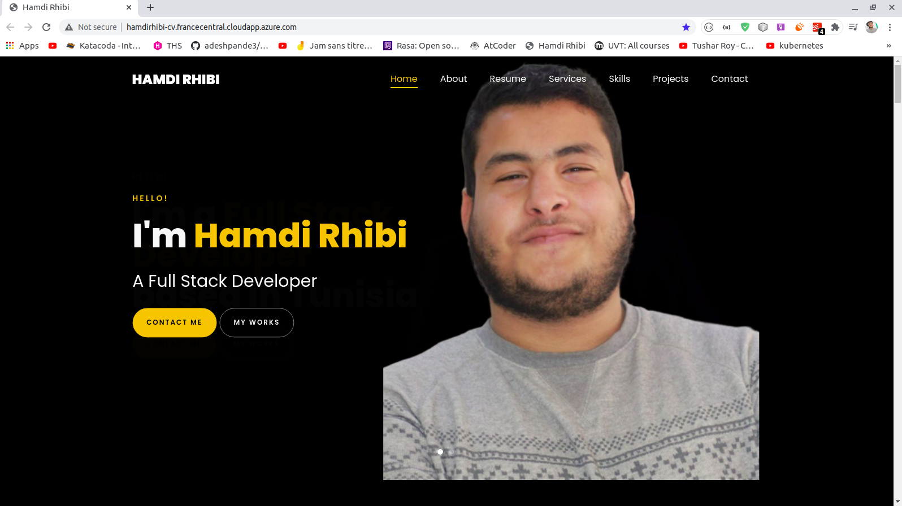

<h1 align="center" style="color :black">
<a href="http://hamdirhibi-cv.francecentral.cloudapp.azure.com/">
    Hamdi Rhibi 

</a>
</h1>

# 📋 Introduction   

 Today im glad to share with you my latest experience with kubernetes and docker , Among this tuto we will going from a simple php portfolio project to a kubernetes cluster deployed in Microsoft Azure, during this workshop we will details the follow points :

- Creating a portfolio project using PHP
- Generating docker image for our project 
- Create A local kubernetes Cluster 
- Install Prometheus and grafana locally using HELM
- Create azure container registry and push our docker image inside it  
- Create Azure Kubernetes service 
- deploy our application to AKS 
- Configure many Kubernetes components such as (deployment,service,ingress,secret file,config_map) 

# 🎉 Technologies used 

- PHP 
- Docker 
- Kubernetes 
- Helm 
- AKS  (azure kubernetes services )

# 📋 Requirements 

- PHP 

- Git  (https://www.atlassian.com/git/tutorials/install-git) 

- Docker .

- Minikube 

- Microsoft azure including the following services (AKS, PUBLIC IP , RESOURCE GROUP )

# 📖 Run The Project

- First Step clone the project : git clone https://github.com/hamdirhibi/cv.git

- cd cv

- You have two option to run it locally  

- NOTE : you have to fill the config/credential.php with your mail account (in order to sent and receive mails )

# First Option (without docker): 

- Run the PHP project locally by copying the project folder to /var/html if you are using Linux or Mac or in c:/wamp OR c:/xamp if you are using windows 

- Open your browser and pass http://localhost/cv

- And its done!

# Second Option (with docker) : 

 *** DOCKER ***

- RUN docker build --rm -f "Dockerfile" -t hamdi.rhibi:latest "." 

- RUN docker run -d -it -p 8000:80/tcp -v your-folder-path:/usr/src/app  --name hamdi.rhibi hamdi.rhibi:latest

- open your browser and pass http://localhost:8000/

- EVERY THING is perfect now after applying some modification in your code you have to commit your changes 

- docker commit your-folder-path/

- and its done!

# Deploy your portfolio inside kubernetes Cluster  : 

# RUN your kubernetes cluster locally:  
  *** KUBERNETES ***

- Create new namespace to separate virtually your portfolio project : kubectl create namespace cv-namespace

- to facilitate the task we will make the cv namespace as default namespace: kubectl config set-context --current --namespace=cv-namespace

- kubectl apply -f cv-secret.yaml 

- kubectl apply -f cv-configmap.yaml 

- kubectl apply -f cv.yaml 

- Got to http://localhost:30000

- TIPS : To get more information about others component : kubectl describe (pod/deployment/service/secret/configmap) name-of-component

- You can specify the domain Name of your cv rather than cluster ip address (you have to change the type of your service from loadbalancer to cluster ), and apply the ingress file which will redirect the requests to your service : 

- kubectl apply -f cv-ingress.yaml 

- Sudo vim /etc/hosts ( add line below localhost containing "your-cluster-ip your-domain name" example  : 192.168.64.5 cv.com )

- Open new nav and pass your-domain-name.com 

- BOMMMMMMM so smart xD  !! 

- New challenge ?  lets run prometheus and Grafana locally using helm!! 

 *** HELM PACKAGE MANGER***

- RUN helm install prometheus stable/prometheus-operator

- To access grafana you need to configure ingress to port forward to Grafana service : RUN kubectl port-forward deployment/prometheus-grafana 3000

- Go to localhost:3000 and login using as login : "admin" and password : "prom-operator"

- What do you think about Grafana xD  ? 

 

# How to Create Azure kubernetes Service  (Using CLI): 

 *** MICROSOFT AZURE ***

- First step you need to login to azure ( but you have install azure locally before : https://www.evernote.com/OutboundRedirect.action?dest=https%3A%2F%2Fdocs.microsoft.com%2Fen-us%2Fcli%2Fazure%2Finstall-azure-cli-apt)
  
- az login

- create resource group : az group create -g cvgrp --location=westus

- create aks (2 nodes) : az aks create -g cvgrp --name=cv --node-vm-size=Standard_D1 --generate-ssh-keys

# How to use azure container registry rather then docker hub 

- create acr : az acr create -g cvgrp --location westus --name cvacr --sku Basic

- second Allow AKS pull access to ACR : export CLIENT_ID=$(az aks show -g cvgrp -n cvacr — query “servicePrincipalProfile.clientId” — output tsv); echo $CLIENT_ID

- export ACR_ID=$(az acr show -g cvgrp -n cvacr — query “id” — output tsv); echo $ACR_ID

- az role assignment create — assignee $CLIENT_ID — role acrpull — scope $ACR_ID

- now build you docker image locally (as we did in the first option) and push it in your acr 

- tag the docker image and push it to registry

- docker tag cv cvacr.azurecr.io/integration/cv:1.0

- docker push vssubscriptionacr.azurecr.io/integration/fftoxml-service:1.0

- thats it !! ==> moving to kube commands now 

    *** KUBERNETES ***

- First synchronize you kubectl with your aks 

- az aks get-credentials -g cvgrp -n cv

- Second construct your .yaml file and deploy them in order to aks cluster using 

- kubectl apply -f cv-secret.yaml

- kubectl apply -f cv-config-map.yaml

- kubectl apply -f cv.yaml

- No lets create a public access to your services 

- verify which group you are: az aks show --resource-group cvgrp --name cv --query nodeResourceGroup -o tsv
- will print ==> MC_cvgrp_cv_francecentral

- create public ip address 

- az network public-ip create --resource-group MC_cvgrp_cv_francecentral --name myAKSPublicIP --sku Standard --allocation-method static --query publicIp.ipAddress -o tsv

- will print id address (ex : ***.***.***.****) 

- pass this ip in your service.yaml like that : 

        apiVersion: v1
        kind : Service
        metadata:
            name: cv-service
            namespace: cv-namespace
        spec:
            loadBalancerIP:  ***.***.***.****
            type: LoadBalancer
            selector:
                app: cv
            ports:
                - protocol: TCP 
                port : 80
                targetPort : 80

- Don't hesitate to leave a comments xD 

- How to install promotheus and Grafana in AKS ? TO BE CONTINUE ... 

 

##  What is Next ? 

- Configure prometheus to get alerts in a various tool like slack and others and receiving message  
- Managing envirement variables inside our cluster  
- Creating new application and applying communication between them inside our kubernetes cluster
- Generating full CI/CD using jenkins , terraform and ansible . 
 ***Stay tuned ...***  

##  Contact Me

don't hesitate to contact me if there any problem or suggestion :
- e-mail : geekrhibi@gmail.com
- linkedin : hamdirhibi
- telegram : 3ezdine junior
